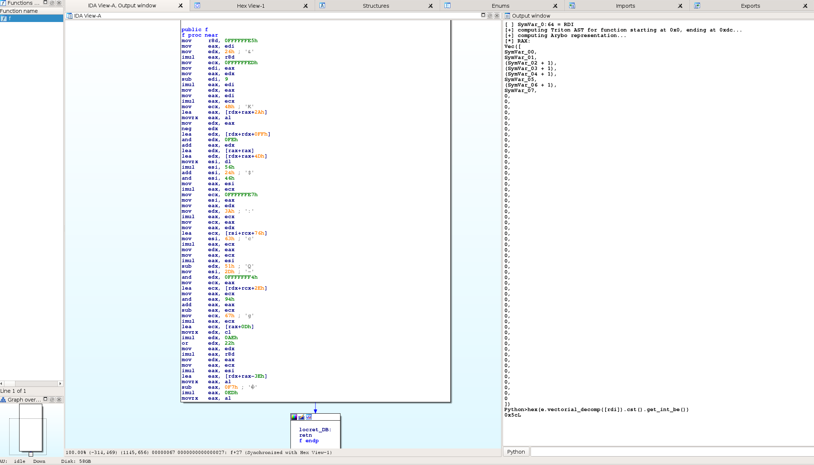

============================
Integration with other tools
============================

Triton
~~~~~~

Triton (http://triton.quarkslab.com/) is a DBA (Dynamic Binary Analysis)
framework that can, among other things, create a symbolic equivalent of a set
of X86 (32/64) instructions. These symbolic expressions are managed through an
AST (Abstract Syntax Tree). More information about Triton's AST can be found in
`its documentation
<http://triton.quarkslab.com/documentation/doxygen/py_ast_page.html>`_.

Arybo can handle a subset of Triton AST to convert it into an MBA variable,
thanks to the :meth:`arybo.tools.triton2arybo` API. Here is a small example (from
``examples/triton_ast.py``):

.. literalinclude:: ../../examples/triton_ast.py

Triton needs to be installed. As it only supports Python 2, a Python 2 version
of Arybo must be present.

IDA
~~~

A small POC is provided in the ``examples/triton_ida.py`` file that shows how
Triton and Arybo can be used to get the symbolic Arybo representation of a
given x86-64 binary function directly in the IDA disassembler.

This POC has been made for 64-bit system Linux systems. The issue is that IDA
uses a 32-bit Python interpreter. The workaround is to use `̀`rpyc`` to have
Triton and Arybo in a 64-bit process, where IDA stays with its 32-bit process
and communication is done through RPC. The overall setup is the following:

* install Arybo and Triton for your 64-bit Linux system for Python 2
* install ``rpyc``: ``pip install rpyc``
* launch the ``rpyc`` server, and make sure it listens on localhost: ``rpyc_classic.py --host 127.0.0.1``
* launch IDA. If you used a virtual environment, you must specify a special
  ``PYTHONPATH`` that points to the Python libraries of your virtualenv (for
  instance:
  ``PYTHONPATH=home/user/.virtualenvs/arybo2/lib/python2.7/site-packages``)

The script for now assumes that the function has one integer argument and
returns an integer into RAX. Go inside a function, and launch the
``example/triton_ida.py`` script. You will see the Triton and the Arybo output
in the output console. Beware that, has computations are usually done on
32/64-bit registers, this can take a quite bit of time! Further work is going
on to improve the performances of this overall process.

Here is on example on a C version of the ``example/xor_5C.py`` function:

There is also ongoing work to make a more user-friendly and generic IDA plugin.
Feel free to contact us if you're interested!
